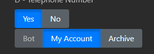
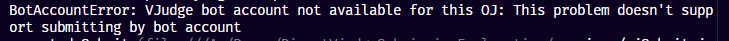
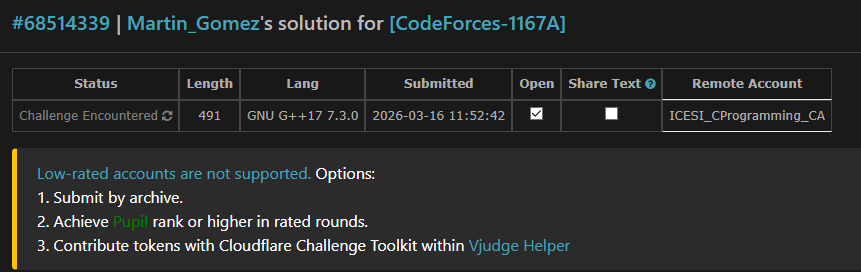

# CF Viability Test

Herramienta web para cargar, visualizar y enviar soluciones a problemas de Codeforces a través de VJudge, diseñada para evaluar la viabilidad de un sistema de envíos automatizado para clubes de programación competitiva.

---

## Motivación

La dificultad de automatizar un submition directamente a los endpoints de CodeForces debido a Claudfare. VJudge ofrece una bot account que actúa como intermediario, pero esta relación es frágil — Codeforces puede bloquearla sin previo aviso.

Este proyecto prueba si es posible construir un flujo de envíos confiable que:

1. Use la bot account de VJudge como camino principal
2. Detecte automáticamente cuando falla y ofrezca un fallback con credenciales propias del usuario
3. Soporte contestas de VJudge (con múltiples problemas de distintos OJs)

---

## Arquitectura

```
┌─────────────────────────────────────────┐
│                Frontend                 │
│  index.html + app.js + style.css        │
│  - Visor de problemas (CF API)          │
│  - Editor de código                     │
│  - Modal de login VJudge                │
│  - Modal de fallback (CF cookie)        │
│  - Polling de veredicto en tiempo real  │
└────────────────┬────────────────────────┘
                 │ REST API
┌────────────────▼────────────────────────┐
│              Backend (Express)          │
│  server.js                              │
│                                         │
│  services/                              │
│  ├── vjSession.js     sesiones cifradas │
│  ├── vjAuth.js        login + verify CF │
│  ├── vjSubmit.js      envío bot/cookie  │
│  ├── vjVerdict.js     polling veredicto │
│  ├── contestService.js  contestas VJ    │
│  └── problemService.js  problemas CF    │
└─────────────────────────────────────────┘
```

---

## Flujo de envío

```
Usuario hace clic en "Submit"
        │
        ▼
POST /api/submit  (bot account, method=0)
        │
   ┌────┴────────────────────────────────┐
   │                                     │
 Éxito                           Error 422
   │                          requiresCookieAuth
   │                                     │
   ▼                                     ▼
Polling de veredicto        Modal: "VJudge bot unavailable"
/api/verdict/:id            El usuario ingresa su JSESSIONID
                                         │
                                         ▼
                            POST /api/submit/cf-cookie
                              1. unverifyAccount (VJudge)
                              2. verifyAccount con JSESSIONID
                              3. submit con method=1
                                         │
                                         ▼
                                Polling de veredicto
```

---

## API

| Método | Endpoint | Descripción |
|--------|----------|-------------|
| `POST` | `/api/login` | Login a VJudge (guarda sesión cifrada) |
| `GET` | `/api/session/:handle` | Verifica si hay sesión activa |
| `DELETE` | `/api/session/:handle` | Cierra sesión |
| `GET` | `/api/problem/:id` | Carga problema de Codeforces |
| `GET` | `/api/contest/:id` | Carga contesta de VJudge |
| `GET` | `/api/languages` | Lista de lenguajes soportados |
| `POST` | `/api/submit` | Envía vía bot account de VJudge |
| `POST` | `/api/submit/cf-cookie` | Envía vía cuenta CF propia del usuario |
| `GET` | `/api/verdict/:id` | Estado de un envío |

## Endpoints utilizados de VJudge

### Autenticación

- `https://vjudge.net/user/login` → Login del usuario en VJudge
- `https://vjudge.net/user/checkLogInStatus` → Verificar si la sesión sigue activa
- `https://vjudge.net/user/verifyAccount` → Verificar cuenta con JSESSIONID (para fallback)
- `https://vjudge.net/user/unverifyAccount` → Invalidar sesión actual (para fallback)

### Contests 

- `https://vjudge.net/contest/${contestId}` → Carga de contestas (incluye lista de problemas)

### Problemas

- `https://vjudge.net/problem/${problemCode}` → Para obtener el problema que se va a enviar (necesario para obtener el `problemId` interno de VJudge, que es distinto al `problemCode` de CF)

### Submissions

- `https://vjudge.net/problem/submit/${problemCode}` → Envío de solución para un problema específico
- `https://vjudge.net/contest/submit/${vjContestId}/${vjIndex}` → Envío de solución para un problema dentro de un contest 

### Resultados

- `https://vjudge.net/solution/${data.id}` → Página de la solución enviada 
- `https://vjudge.net/solution/data/${runId}` → Endpoint que devuelve el estado actual del envío (veredicto, tiempo de ejecución, memoria usada, etc.)


## Endpoints utilizados de Codeforces 

### API oficial 
- `https://codeforces.com/api/problemset.problems` → Carga de problemas (para mostrar enunciados, restricciones, etc.)
- `https://codeforces.com/api/contest.list` → Carga de lista de concursos (para mostrar en el filtro de problemas)

### Problemas 

- `https://codeforces.com/problemset/problem/${contestId}/${index}` → Para obtener el enunciado del problema, restricciones, etc. (se hace desde el frontend para renderizar el enunciado con LaTeX)
- `https://mirror.codeforces.com/contest/${contestId}/problem/${index}` → Alternativa para obtener el enunciado del problema (en caso de que el endpoint oficial falle por CORS o rate limits)
 
### Códigos de respuesta relevantes

- `200` — OK
- `401` — Sesión VJudge expirada
- `422` + `requiresCookieAuth: true` — Bot account bloqueada, se requiere cookie CF
- `500` — Error genérico

---

## Estructura de archivos

```
├── server.js                  Servidor Express + rutas
├── config/
│   └── config.js              Puerto y configuración general
├── services/
│   ├── vjSession.js           Persistencia de sesiones (AES-256-CBC)
│   ├── vjAuth.js              Login VJudge, verifyAccount CF
│   ├── vjSubmit.js            Lógica de envío (bot + fallback)
│   ├── vjVerdict.js           Polling y mapeo de veredictos
│   ├── contestService.js      Carga de contestas VJudge
│   └── problemService.js      Carga de problemas Codeforces
├── sessions/                  Sesiones cifradas (gitignore)
└── public/
    ├── index.html
    ├── app.js
    └── style.css
```

---

## Instalación

```bash
npm install
node server.js
```

Requiere Node.js 18+. Puerto definido en `config/config.js`.

### Variables de entorno

| Variable | Descripción | Default |
|----------|-------------|---------|
| `SESSION_SECRET` | Clave para cifrar sesiones en disco | `cf-club-secret-2024` |

---

## Sesiones

Las sesiones VJudge se guardan en `sessions/<handle>.json` cifradas con AES-256-CBC. No se almacenan contraseñas, solo las cookies de sesión obtenidas tras el login.

---

## Limitaciones conocidas

- **JSESSIONID manual**: El flujo de fallback requiere que el usuario extraiga su `JSESSIONID` de las DevTools del navegador. Automatizar esto no es viable: el endpoint de login de Codeforces está protegido por Cloudflare Turnstile, que requiere ejecución real de browser para resolverse.
- **Lenguajes**: El mapa de IDs CF → VJudge cubre los más comunes (C++17, C++20, Python 3, PyPy 3, Java 11). Otros requieren extensión manual.
- **Contestas privadas**: VJudge no expone el `dataJson` de contestas privadas; esas no pueden cargarse.

---

## Conclusión de viabilidad

**Es viable.** El sistema funciona de extremo a extremo: carga problemas, renderiza enunciados con LaTeX, envía soluciones y reporta veredictos en tiempo real.

El único caveat real es la fragilidad de la conexión entre VJudge y Codeforces, que puede manifestarse de dos formas:

- **Bot account deshabilitada**: Codeforces bloquea periódicamente los envíos vía bot de VJudge.


- **Restricción de rating**: Algunos problemas exigen un rating mínimo en la cuenta de Codeforces del usuario.


Ambos casos están manejados: la bot account se intenta primero y, si falla por cualquiera de estas razones, el sistema detecta el error automáticamente y le pide al usuario su sesión de CF para continuar. Más allá de esa fragilidad inherente a la relación VJudge–Codeforces, el flujo es estable.
